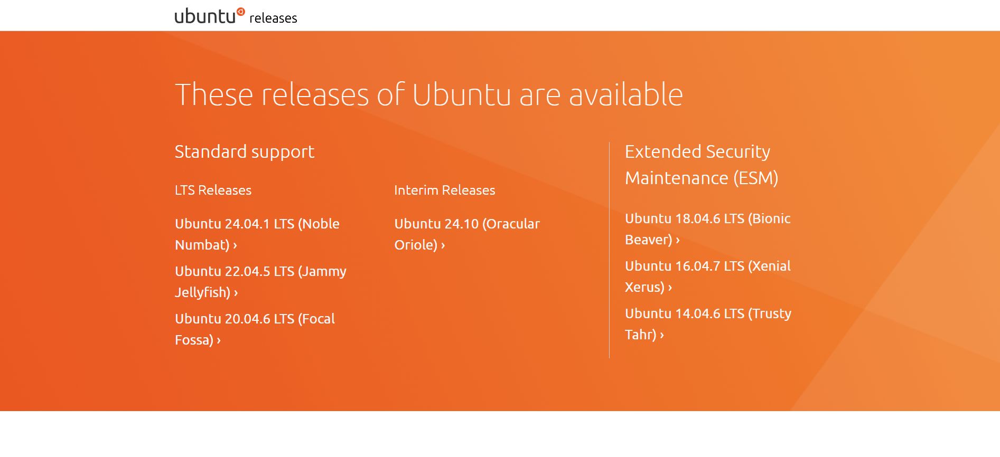
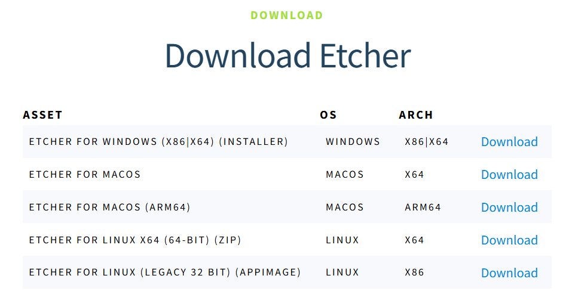
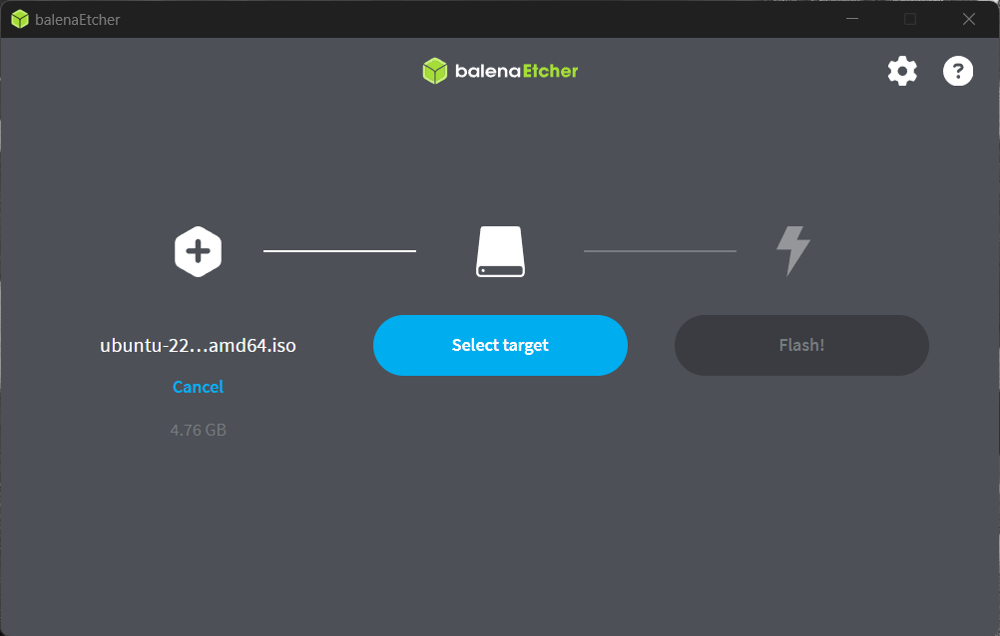
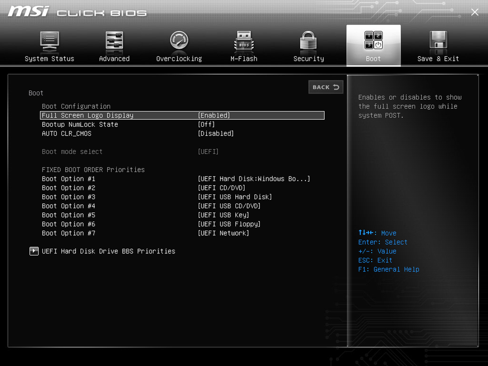
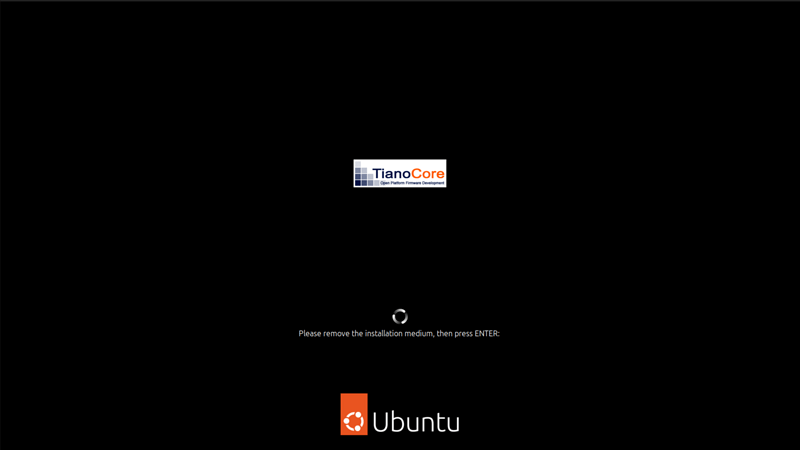
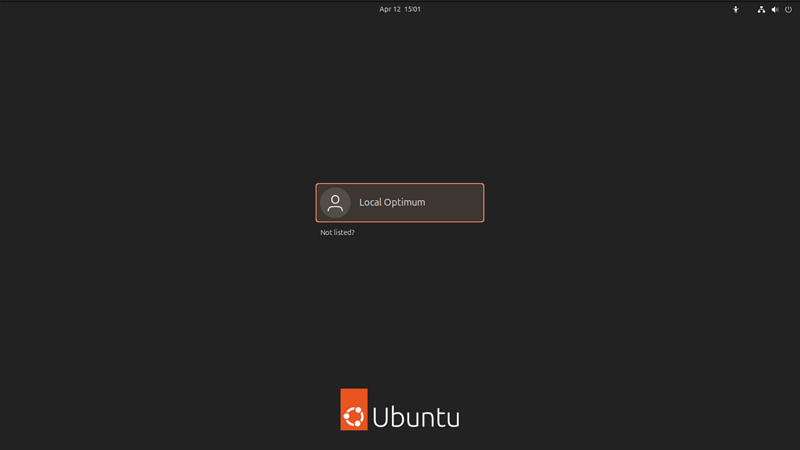
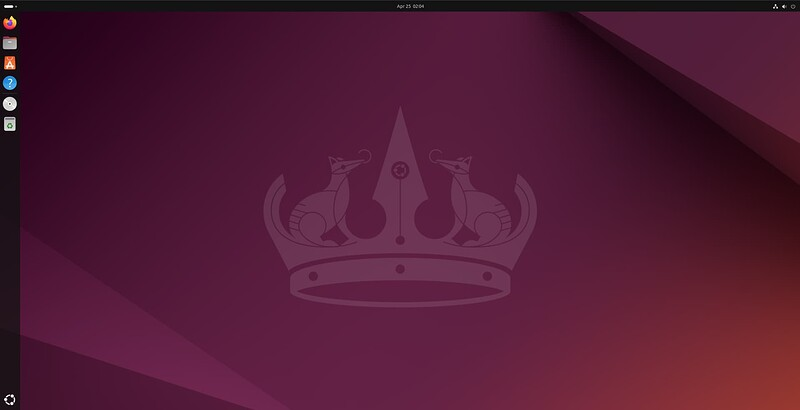

> ### Requirement 
> To install Ubuntu Desktop on your laptop or PC, things you need :
> - A laptop or PC with at least 25GB of storage space.
> - A flash drive (12GB or above recommended).

### Introduction
[Ubuntu](https://www.youtube.com/watch?v=q5yM4ZYwB_s) is a free and open-source operating system based on Linux. It is maintained by Canonical Ltd. and the community of developers. Ubuntu is designed to be user-friendly, secure, and adaptable, making it a popular choice for desktops, servers, and even cloud computing.

---

### Step 1: Download an Ubuntu Image
For this tutorial, we will use the latest Ubuntu 22.04.5 LTS (Jammy Jellyfish). You can download an mirror Ubuntu image [here](https://mirror.twds.com.tw/ubuntu-releases/). Make sure to save it to a memorable location on your PC! 

### Step 2: Create a Bootable USB stick
To install Ubuntu Desktop, you need to write your downloaded ISO to a USB stick to create the installation media. This is not the same as copying the ISO, and requires some bespoke software.  

For this tutorial, we’ll use [balenaEtcher](https://etcher.balena.io/#download-etcher), as it runs on Linux, Windows and Mac OS. Choose the version that corresponds to your current operating system, download and install the tool.

Select your downloaded ISO, choose your USB flash drive, and then click **Flash**! to install your image.

  

### Step 3: Boot from USB flash drive
Insert the USB flash drive into the laptop or PC you want to use to install Ubuntu and boot or restart the device. When starting the PC, try repeatedly pressing `DELETE` button during startup and selecting the USB device from the system-specific boot menu.

### Step 4: Installation Setup
Different types of Ubuntu version will show different installation interfaces, Generally, you can just follow the installation wizard to choose keyboard and system language, select installation type, create user login details, choose region and timezone. Clicking `Next` will take you to a summary of your installation configuration to give you a chance to confirm your setup before clicking `Install`.

Once the installation has completed, you will be prompted to remove your USB flash drive from the device and restart your machine. 

Once you’ve done this, press `ENTER`. Then enter your username and password.

And that’s it, welcome to your new Ubuntu Desktop!

---

### References
[Install Ubuntu Desktop](https://ubuntu.com/tutorials/install-ubuntu-desktop#1-overview)