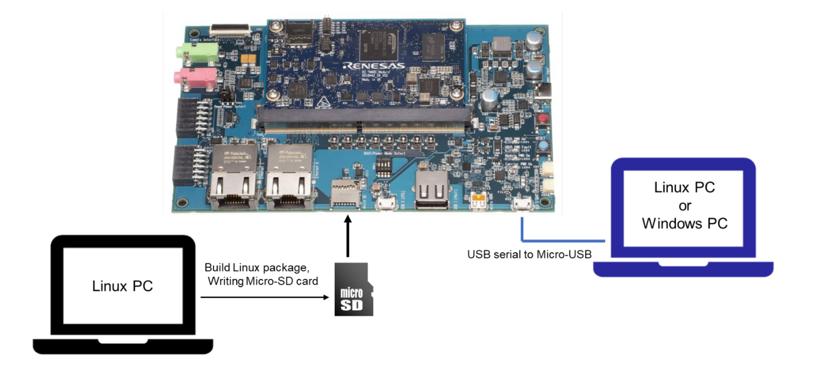

### Introduction


### Step 1: Write Image to SD Card
Exit the Docker container, insert SD card to the PC

Enter the commands below,

```bash=title:"check device ID of SD card"
sudo fdisk -l
```

```bash=title:"unmount /dev/sda1 and /dev/sda2"
umount /dev/sda1
umount /dev/sda2
```

```bash=title:"flash the image into SD card"
sudo bmaptool copy core-image-qt-smarc-rzg2l.wic.gz /dev/sda
```

### Step 2: Boot up RZ/G2L
Remove SD card, insert it to RZ/G2L, connect the power input and serial monitor to your personal PC and boot up by long pressing the red button.




