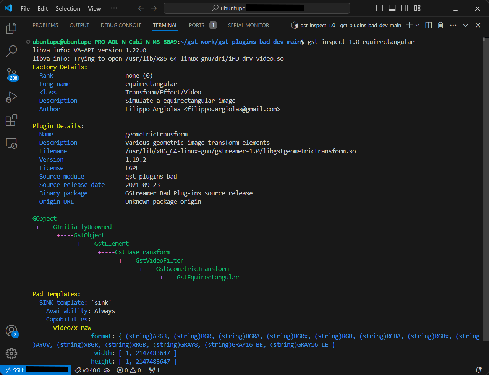

### Step 1: Clone project from Github
The `gst-plugins-bad-dev` package is part of the GStreamer multimedia framework and provides the development files needed for working with the "bad" set of plugins in GStreamer.

This is the referenced original project on Github:
```bash
https://github.com/GStreamer/gst-plugins-bad
```

Clone the modified version below:
```bash
git clone https://github.com/yourskc/gst-plugins-bad-dev
```

This project includes a new element named equirectangular as part of the gst-plugins-bad geometric transform plugin. It contains GStreamer code units, build instructions, and test commands.

### Step 2: Install & Build Menson
Install Menson using the command below:

```bash
sudo apt-get install python3 python3-pip python3-setuptools \
python3-wheel ninja-build
```

```bash
pip3 install --user meson
```

Build Mension using the command below:

```bash
meson build
ninja -C build
```

Verify the build by checking the creation of the file `libgstgeometrictransform.so` in the directory `~/gst-work/gst-plugins-bad-dev-main/build/gst/`geometrictransform.

### Step 3: Install the library and inspect
Install using the command below:

```bash
sudo cp ./build/gst/geometrictransform/libgstgeometrictransform.so /usr/lib/x86_64-linux-gnu/gstreamer-1.0
```

Check the `gst-inspect` output
```bash
gst-inspect-1.0 equirectangular
```

Expected output:


