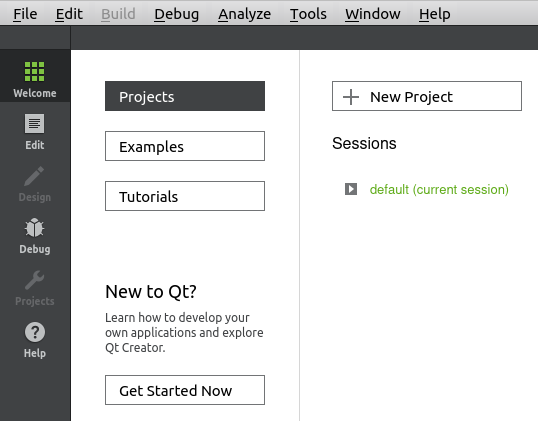
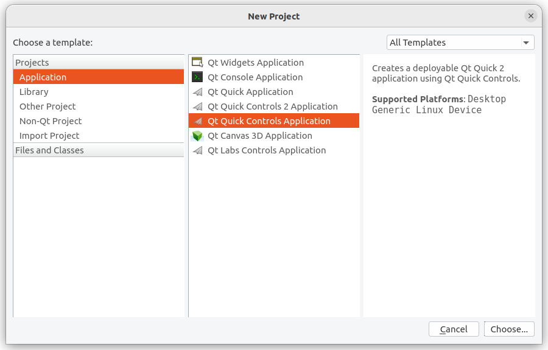
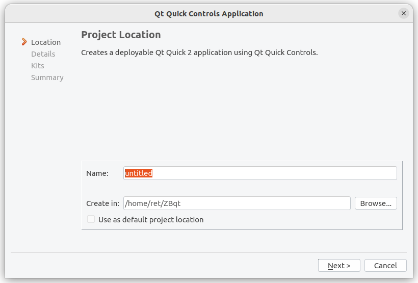
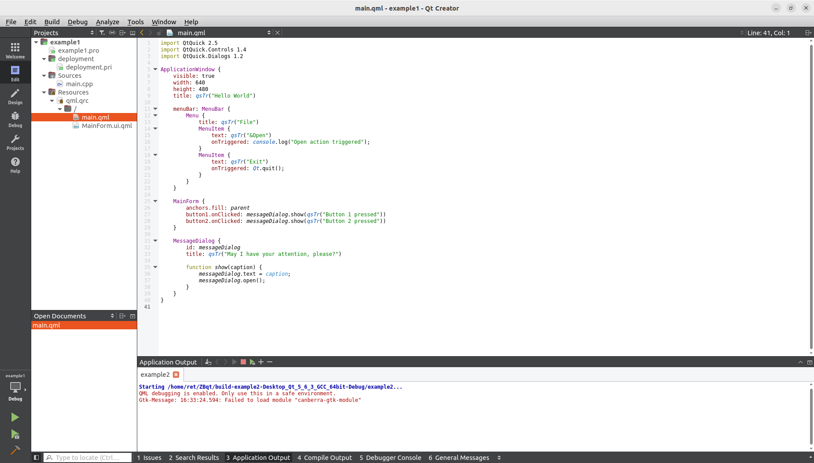
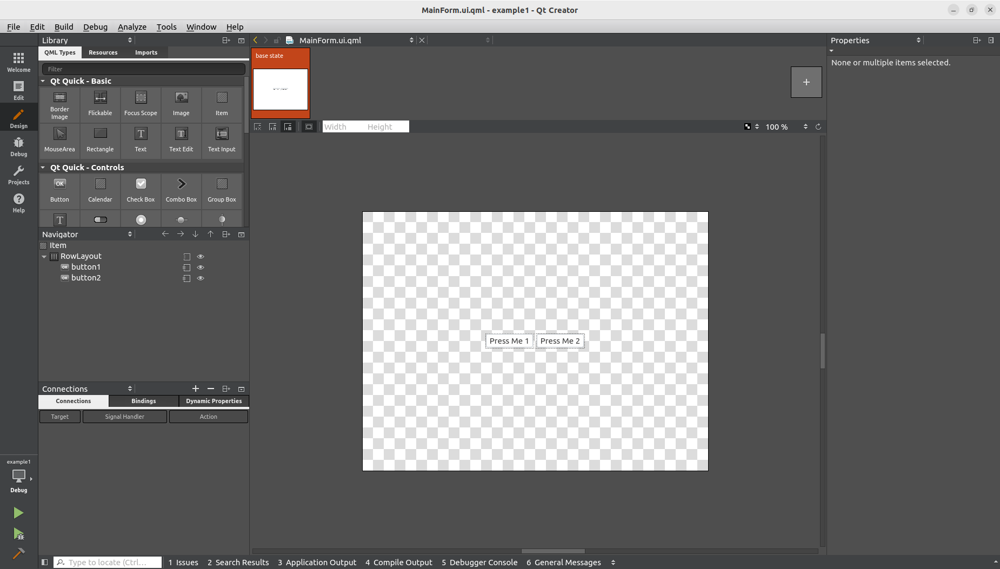
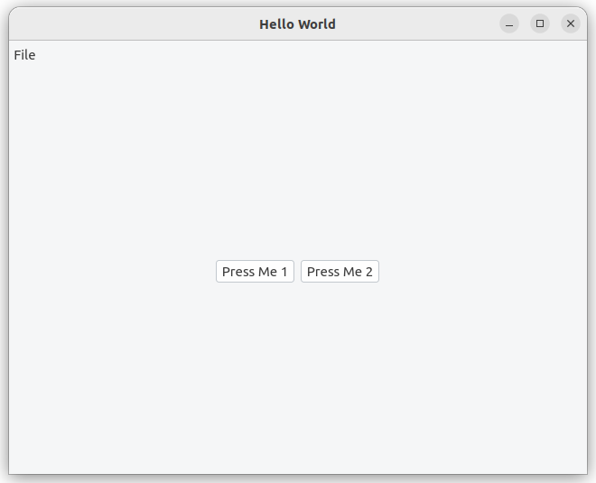
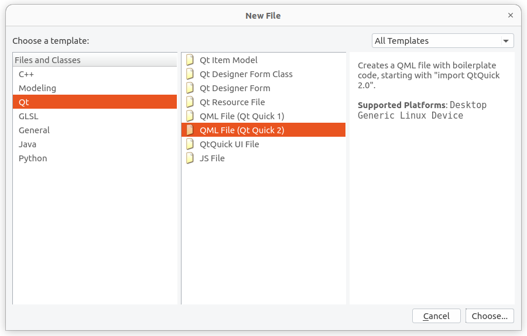
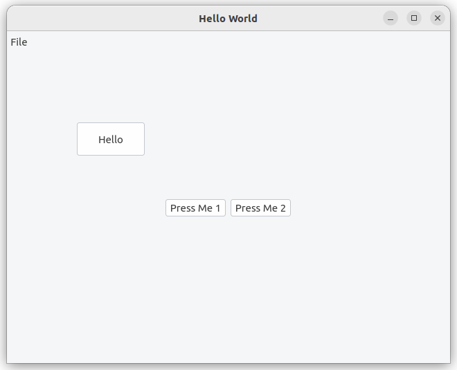

We are about to create a Qt project, open an example project for pratice or create a blank new project.

### Step 1: Open Qt Creator
Open Qt Creator by using this command

```bash title="Open a terminal window, input the commands,"
unset LD_LIBRARY_PATH
source /opt/poky/3.1.31/environment-setup-aarch64-poky-linux
```

```bash title="Run Qtcreator ( Qt5.6.3 )"
cd ~/Qt5.6.3/Tools/QtCreator/bin/
./qtcreator
```

### Step 2: Create New Project
Click on the `Welcome` on the left top, then click `New Project`



Choose `Application/Qt Quick Controls Application`



Input the **name** and **location** of your project and proceed `Next` until the end.



You have successfully create a new project.

### Step 3: Build Default Control Application


Click `Design`, Qt will switch to Design mode immediately. Under Design mode, we can drag the objects like buttons, or drag the contols from the left side to the center canvas. You also can click on anyone of the control list, then set it's properties on the right-hand side. 



You can click the 'Edit' to switch the window back to Edit mode to see all of the changes. Then, click the `Run` button to build the project.



### Step 4: Add a 'Hello' Button
Right Click `/` under `Resources/qml.qrc`, add new qml file named 'Btn'.



Modify the code of Btn.qml to

```bash 
import QtQuick 2.5
import QtQuick.Controls 1.4
import QtQuick.Layouts 1.2
        Button {
            width: 100
            height: 50
            id: button1
            text: qsTr("Hello")
            }
```

Add the code to `ApplicationWindow { }` in main.qml

```bash 
Btn {
    x:100
    y:100
}
```

Click on `Run` button in the lower left corner, the 'Hello' Button is created.




